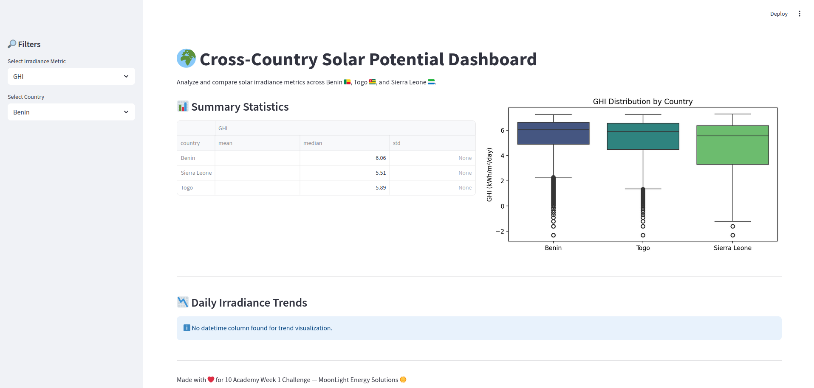

# 🌞 Solar Challenge: Cross-Country Solar Farm Analysis

> **Challenge to Kickstart AI Mastery with Cross-Country Solar Farm Analysis**
> A data-driven comparison of solar energy potential in Benin 🇧🇻, Sierra Leone 🇸🇱, and Togo 🇹🇬

[](https://solar-challenge-week1-srciwinqcgpf22litkpyhb.streamlit.app/)


---

## 🧰 Table of Contents

- [🌞 Solar Challenge: Cross-Country Solar Farm Analysis](#-solar-challenge-cross-country-solar-farm-analysis)
  - [🧰 Table of Contents](#-table-of-contents)
  - [📸 Streamlit App Preview](#-streamlit-app-preview)
  - [📌 Overview](#-overview)
  - [🌟 Background](#-background)
    - [Key Irradiance Metrics:](#key-irradiance-metrics)
  - [🗂️ Project Structure](#️-project-structure)
  - [🛠️ Tech Stack](#️-tech-stack)
  - [⚖️ Setup Instructions](#️-setup-instructions)
  - [📊 Methodology](#-methodology)
  - [🔍 Key Insights](#-key-insights)
    - [💡 GHI (Global Horizontal Irradiance)](#-ghi-global-horizontal-irradiance)
    - [💡 DNI (Direct Normal Irradiance)](#-dni-direct-normal-irradiance)
    - [💡 DHI (Diffuse Irradiance)](#-dhi-diffuse-irradiance)
  - [✅ Country Suitability for Solar Investment](#-country-suitability-for-solar-investment)
  - [📊 Statistical Tests (GHI)](#-statistical-tests-ghi)
  - [📌 Recommendations](#-recommendations)
  - [📊 Visual Outputs](#-visual-outputs)
  - [🥺 Run Tests](#-run-tests)
  - [🚀 Deployment](#-deployment)
  - [📄 License](#-license)
  - [🤝 Contributing](#-contributing)
  - [📢 Contact](#-contact)

---

## 📸 Streamlit App Preview



---

## 📌 Overview

This project was developed as part of the **10 Academy Week 1 Challenge**, aimed at assessing solar energy potential across three West African countries to support strategic investment decisions by **MoonLight Energy Solutions**.

We compare solar irradiance metrics and environmental conditions to evaluate each country's suitability for solar power deployment.

---

## 🌟 Background

**MoonLight Energy Solutions** is focused on scaling clean energy by identifying optimal regions for solar installations.

### Key Irradiance Metrics:

* **GHI (Global Horizontal Irradiance)** – Total solar radiation on a horizontal surface.
* **DNI (Direct Normal Irradiance)** – Solar radiation aligned with the sun's rays.
* **DHI (Diffuse Horizontal Irradiance)** – Scattered radiation received indirectly.

Additional variables analyzed:

* ☁️ Air Temperature
* 💧 Humidity
* 🌬️ Wind Speed
* ☔️ Precipitation
* 🧽 Sensor Cleaning Events

---

## 🗂️ Project Structure

```
solar-challenge-week1/
├── app/                  # Streamlit app code
├── data/                 # Cleaned and raw data
├── notebooks/            # Jupyter notebooks
├── scripts/              # Custom Python modules
├── tests/                # Unit tests
├── .streamlit/           # Streamlit configuration
├── requirements.txt      # Python dependencies
└── README.md             # Documentation
```

---

## 🛠️ Tech Stack

* Python 3.10
* Pandas, NumPy – Data wrangling
* Seaborn, Matplotlib – Visualization
* Streamlit – Web dashboard
* Pytest, Flake8 – Testing and linting
* GitHub Actions – Continuous integration

---

## ⚖️ Setup Instructions

```bash
# 1. Clone the repository
$ git clone https://github.com/Teshager21/solar-challenge-week1.git
$ cd solar-challenge-week1

# 2. Create virtual environment
$ python -m venv venv
$ source venv/bin/activate   # macOS/Linux
$ venv\Scripts\activate      # Windows

# 3. Install dependencies
$ pip install -r requirements.txt

# 4. Run the app
$ streamlit run app/main.py
```

---

## 📊 Methodology

* Load and merge solar datasets from 3 countries
* Clean data, handle outliers, impute missing values
* Analyze irradiance and environmental metrics
* Visualize key metrics by country and over time
* Run statistical significance tests (ANOVA, Kruskal-Wallis)
* Provide investment recommendations

---

## 🔍 Key Insights

### 💡 GHI (Global Horizontal Irradiance)

* **Togo** has the highest median and peak GHI.
* **Benin** and **Sierra Leone** have competitive but slightly lower GHI levels.

### 💡 DNI (Direct Normal Irradiance)

* **Togo** leads with highest DNI — ideal for sun-tracking PV or CSP.

### 💡 DHI (Diffuse Irradiance)

* Similar distributions across countries, relevant for cloudy days.

---

## ✅ Country Suitability for Solar Investment

| Country               | Summary                                                                |
| --------------------- | ---------------------------------------------------------------------- |
| 🇹🇬 **Togo**         | 🌟 Most promising. High GHI & DNI. Ideal for multiple PV technologies. |
| 🇧🇻 **Benin**        | 👍 Strong potential. Competitive GHI levels.                           |
| 🇸🇱 **Sierra Leone** | ⚠️ Lower irradiance. Use high-efficiency or hybrid systems.            |

---

## 📊 Statistical Tests (GHI)

* **ANOVA F-statistic:** 163.54
* **p-value:** 0.0000
* **Kruskal–Wallis H-statistic:** 428.27
* **p-value:** 0.0000

> These indicate **statistically significant** differences in solar potential across countries.

---

## 📌 Recommendations

* ✅ **Invest in Togo** for both fixed-tilt and tracking solar technologies.
* ✅ **Develop Benin** as a promising secondary location.
* ⚠️ **Use hybrid strategies** in Sierra Leone due to slightly lower solar input.

---

## 📊 Visual Outputs

* 📊 Boxplots of GHI, DNI, DHI by country
* 📉 Bar chart of country-wise average irradiance
* 📄 Statistical summaries per country

---

## 🥺 Run Tests

```bash
pytest --tb=short
```

Or with coverage:

```bash
pytest --cov=scripts tests/
```

---

## 🚀 Deployment

The app is deployed via **Streamlit Cloud**:

* ✨ Public link: [solar-challenge-week1.streamlit.app](https://solar-challenge-week1-srciwinqcgpf22litkpyhb.streamlit.app/)
* ⚠️ Fallback data will be used if `data/` is not present in the GitHub repo.

To deploy your own version:

* Fork the repo
* Push to `main` branch
* Set up Streamlit Cloud with `app/main.py` as entrypoint

---

## 📄 License

MIT License. See [LICENSE](LICENSE) file.

---

## 🤝 Contributing

* ⭐ Star this repo
* 📂 Fork & clone
* 🐛 File issues or feature requests
* 📥 Submit a pull request!

---

## 📢 Contact

* **Author:** Teshager Admasu
* [GitHub: @Teshager21](https://github.com/Teshager21)
* [LinkedIn: @Teshager Admasu](https://www.linkedin.com/in/teshager-admasu-531090191)
* [Email](mailto:teshager8922@gmail.com)

---

> “Empowering sustainable energy solutions through data-driven insights.”
